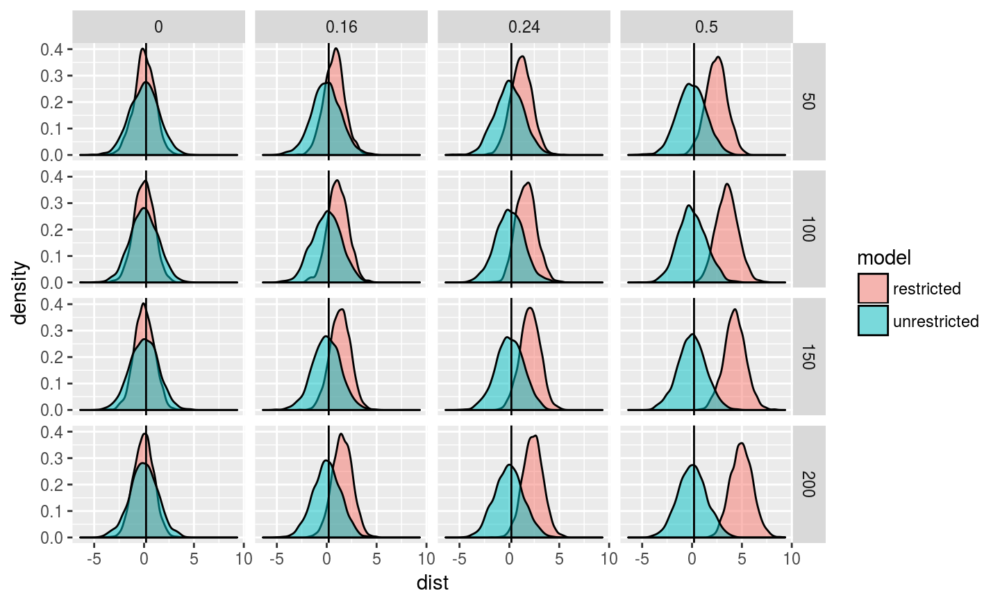
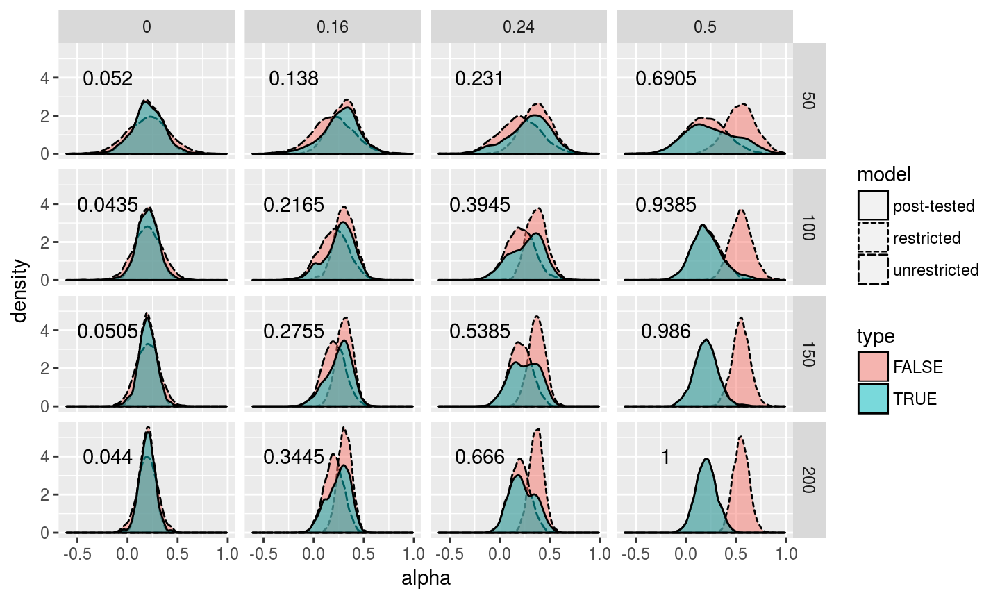

## Proof of the consistency of t-test
- t-test: 
\[ H_0: \beta = 0 \ vs. \ H_a: \beta \neq 0  \]
If the true model is when $\beta = 0$, then
\[ t = \frac{\hat{\beta}}{\sqrt{\frac{1}{n}\hat{V}_{\beta}}} 
= \frac{\sqrt{n}\hat{\beta}}{\sqrt{\hat{V}_{\beta}}} \overset{d}{\longrightarrow} N(0, 1) \]
and as $n \rightarrow \infty$
\[ Pr( |t| < c | H_0 \ is \ true ) \rightarrow 1 - \alpha \neq 1 \]
Maybe lowering $\alpha \rightarrow 0$ will make it consistent.

-------------

On the other hand, if the true model is when $\beta \neq 0$, then
\[ t = \frac{\hat{\beta}}{\sqrt{\frac{1}{n}\hat{V}_{\beta}}} 
= \frac{\sqrt{n}(\hat{\beta} - \beta)}{\sqrt{\hat{V}_{\beta}}} + \frac{\sqrt{n}\beta}{\sqrt{\hat{V}_{\beta}}} = Z + \sqrt{n}\frac{\beta}{\sqrt{\hat{V}_{\beta}}}\]
and as $n \rightarrow \infty$, $t \rightarrow \infty$
\[ Pr( |t| >c | H_a \ is \ true ) \rightarrow 1 \]
t-test is consistent in this case.

## Consistency of Post-test Estimator of $\alpha$
- $\hat{\alpha}_u$ is always consistent for $\alpha$, while $\hat{\alpha}_r$ is consistent for $\alpha$ only if $\beta = 0$. If the post-test estimator acts as follows:
$$
\begin{align}
  \hat{\alpha}_{pt} = 
  \begin{cases}
  \hat{\alpha}_r && \text{if} \ \beta = 0 \ 
  \text{and t-test doesn't reject} \ H_0 \\
  \hat{\alpha}_u && \text{if} \ \beta \neq 0 \ 
  \text{and t-test rejects} \ H_0
  \end{cases}
\end{align}
$$
then $\hat{\alpha}_{pt}$ is consistent for $\alpha$.

As we've shown earlier, even if $n \rightarrow \infty$, we may not reject $H_0$ when $\beta = 0$, we'll choose unretricted OLS. But $\hat{\alpha}_u$ is always consistent for $\alpha$, so we are fine in this case. On the other hand, when $\beta \neq 0$, as $n \rightarrow \infty$, we will eventurally correctly reject $H_0$, and we choose $\hat{\alpha}_u$, which is consistent as well. So post-test estimator will always be consistent for $\alpha$.

## Variances of Three Estimators under Null

Table: Variance of Three Estimators under Null

   n   beta   Restricted   Unrestricted   Post-test
----  -----  -----------  -------------  ----------
  50      0        0.021          0.042       0.026
 100      0        0.010          0.020       0.013
 150      0        0.007          0.013       0.008
 200      0        0.005          0.010       0.006

- Under null hypothesis, variance of the unrestricted model is the largest, while the restricted model has the lowest variance. The variance of the post-tested model falls in the middle of the two.

## Mean of Biases under Alternative

Table: Mean of Biases under Alternative

   n   beta   Restricted   Unrestricted   Post-test
----  -----  -----------  -------------  ----------
  50   0.16        0.108         -0.007       0.064
 100   0.16        0.112          0.000       0.058
 150   0.16        0.110         -0.001       0.053
 200   0.16        0.111          0.001       0.048
  50   0.24        0.170         -0.001       0.091
 100   0.24        0.170          0.004       0.067
 150   0.24        0.170          0.003       0.048
 200   0.24        0.167         -0.002       0.027
  50   0.50        0.348         -0.004       0.056
 100   0.50        0.352          0.001       0.011
 150   0.50        0.350          0.000       0.002
 200   0.50        0.351          0.003       0.003

------------

- For the unrestricted model, it is always unbiased.
- For the restricted model, under alternative hypothesis when $\beta \neq 0$, it's biased upward and it's more severe when $\beta$ is larger and n gets larger.
- For the post-tested model, it's biased upward, but when $\beta$ is far from zero and n gets larger bias goes away since null hypothesis is more likely to be rejected and we choose unrestricted model.
- Bias is always upward, and it's consistent with the omitted-variable bias formula ($\beta > 0, cov(X1,X2) >0$).

## Coverage of the CI

Table: Coverage of the CI

   n   beta   Restricted   Unrestricted   Post-test
----  -----  -----------  -------------  ----------
  50   0.00        0.946          0.952       0.932
 100   0.00        0.956          0.954       0.942
 150   0.00        0.951          0.950       0.938
 200   0.00        0.950          0.948       0.936
  50   0.16        0.889          0.941       0.878
 100   0.16        0.798          0.951       0.818
 150   0.16        0.733          0.949       0.782
 200   0.16        0.660          0.958       0.750
  50   0.24        0.780          0.951       0.803
 100   0.24        0.624          0.948       0.746
 150   0.24        0.467          0.952       0.724
 200   0.24        0.364          0.948       0.758
  50   0.50        0.373          0.956       0.772
 100   0.50        0.109          0.952       0.908
 150   0.50        0.028          0.947       0.938
 200   0.50        0.003          0.946       0.946

-----------
- Under $H_0$, all estimators have the coverage approximately equal to 95%.
- Under $H_1$, for the restricted model, the coverage decreases as $\beta$ and n get larger.
- - For the unrestricted model, it stays approximately 95%.
- - For the post-tested model, with small sample size, as beta increases, we are getting worse coverage; for smaller bias (e.g 0.16), the coverages get worse as sample size increases; however, for large bias (i.e 0.5), as sample size increases, the coverage also increases, eventually approches 95%.

## Density of the Standardized Distribution

## Comments

- Under $H_0: \beta =0$, both estimators are unbiased.
- Under $H_1: \beta \neq 0$, as n gets larger, unrestricted estimator is still unbiased, but restricted ones are always biased upward. 
- This is consistent with the omitted-variable bias formula.

## Add post-test Estimator

## Summarize
- Under $H_1$, everyday OLS is consistent but not unbiased. As sample size gets larger the distribution of the everyday OLS converges to the unbiased OLS distribution.
- Under $H_0$, it converses to the distribution of the restricted OLS. However, under $H_1$, it converges to the distribution of the unrestricted model. Also when beta is larger, it converges faster.
