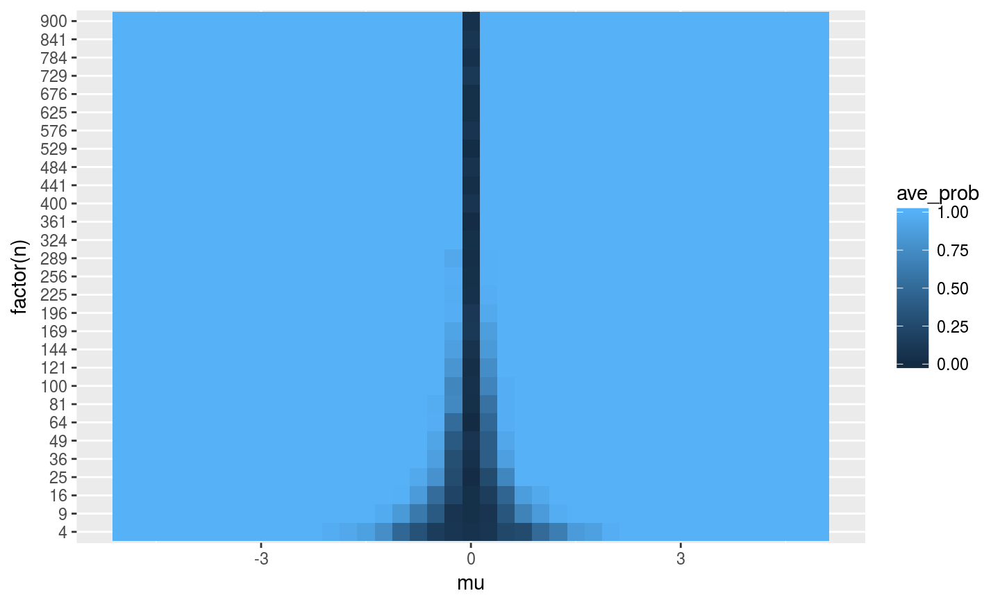
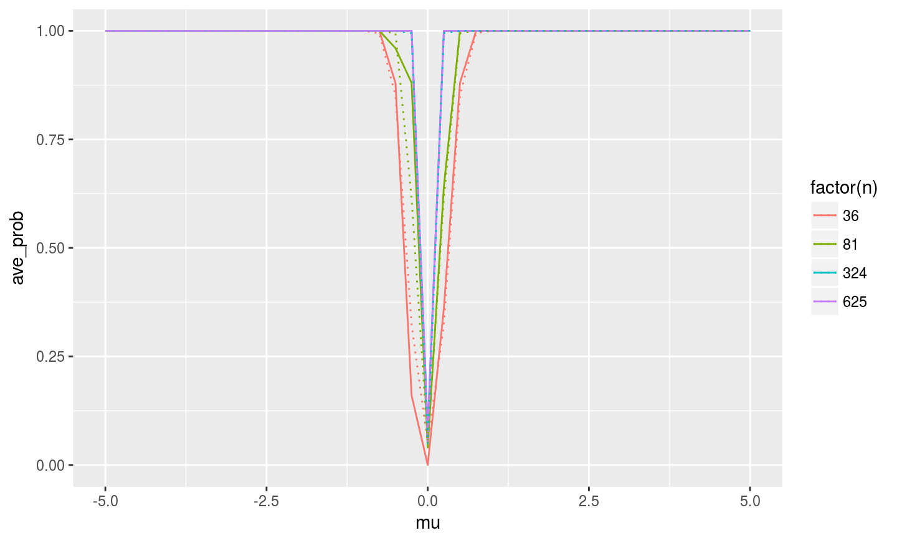
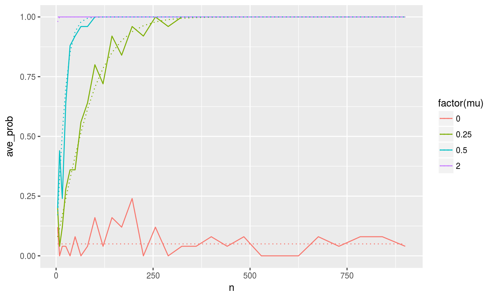
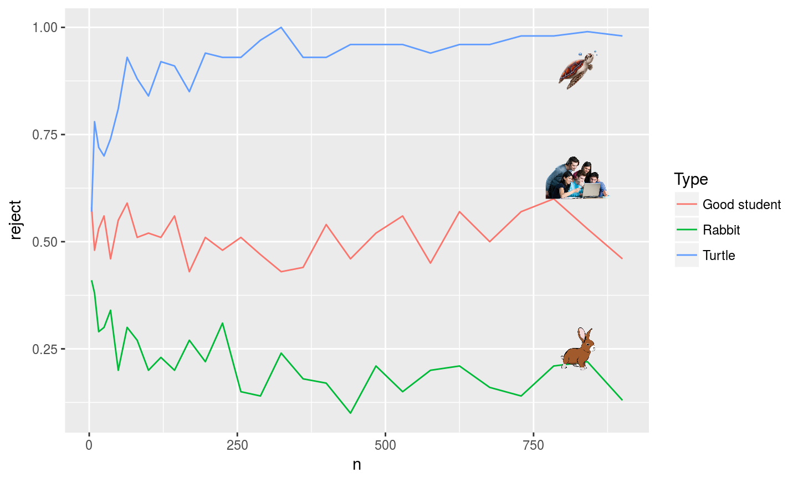

## The power curve
Let $z = \sqrt{n}\bar{X}$, then under $H_0$, $z \sim N(0,1)$, 

under $H_1$, $\sqrt{n}(\bar{X} - \mu) \sim N(0,1)$.

$$\begin{align}
power &= Pr(reject \ H_0 |\ H_1 \ \text{is true}) \\
&= Pr(z > 1.96 |\ H_1) + Pr(z < -1.96 |\ H_1) \\
&= 1 - Pr(\sqrt{n}\bar{X} < 1.96 |\ H_1) + Pr(\sqrt{n}\bar{X} < -1.96 |\ H_1)) \\
&= 1 - Pr(\sqrt{n}(\bar{X} - \mu)> 1.96- \sqrt{n}\mu|\ H_1) \\
&+ Pr(\sqrt{n}(\bar{X} - \mu) < -1.96 - \sqrt{n}\mu|\ H_1) \\
&= 1 - \Phi(1.96 - \sqrt{n}\mu) + \Phi(-1.96 - \sqrt{n}\mu)
\end{align}$$
where $\Phi(\cdot)$ is the cdf of standard normal.

## Heatmap of Average Rejection Rate

## Comments

- Under $H_0$, the probability of rejecting is just the size, which equals 0.05.
- Under $H_1$, as the sample size increases or the deviation from the null increases, power increases.

## Power Curve under 4 n's

## Comments

- As the sample size increases, the power curve shrinks, and the power curve gets closer to the theoretical one.
- After the sample size gets large enough (say 400), there's little improvement in power afterwards.

## Power Curve under 4 mu's

## Comments

- Under $H_0$, the rejection rate in theory should be 0.05 regardless of sample size, and simulated result is consistent with this fact.
- Under $H_1$, as the samples size increases, the power converges to 1. Also the larger the $\mu$ is, the faster the power converges.

## Local Power

## Comments
For rabbit, $\mu = 2/n^{0.6}$
$$\begin{align}
power &= 1-\Phi(1.96 - 2n^{-0.1}) + \Phi(-1.96 - 2n^{-0.1})\\
& \rightarrow 1- \Phi(1.96) + \Phi(-1.96) = 0.05
\end{align} 
$$

For good students, $\mu = 2/n^{0.5}$,

$$
power = 1 - \Phi(1.96 - 2) + \Phi(-1.96 - 2) \approx 0.5
$$

For turtle, $\mu = 2/n^{0.4}$,
$$
power = 1 - \Phi(1.96 -2n^{0.1} ) + \Phi(-1.96 - 2n^{0.1})  \rightarrow 1
$$

## Final Comments
- When $\beta$ follows a rabbit sequence, the distribution of post-test estimator converges slowly to restricted one (which is incorrect), power converges to 0.05 at a very slow rate. 

\[ t = \frac{\hat{\beta}}{\sqrt{\frac{1}{n}\hat{V}_{\beta}}} 
= \frac{\sqrt{n}(\hat{\beta} - \beta)}{\sqrt{\hat{V}_{\beta}}} + \frac{\sqrt{n}\beta}{\sqrt{\hat{V}_{\beta}}} = Z + \sqrt{n}\frac{\beta}{\sqrt{\hat{V}_{\beta}}}\]
With $\beta = 2/n^{0.6}$,
$$t = Z + \frac{2n^{-0.1}}{\sqrt{\hat{V}_{\beta}}} \rightarrow Z$$

$$Pr( |t| >c | H_a \ is \ true ) \rightarrow Pr( |Z|>c ) = \alpha = 0.05$$
