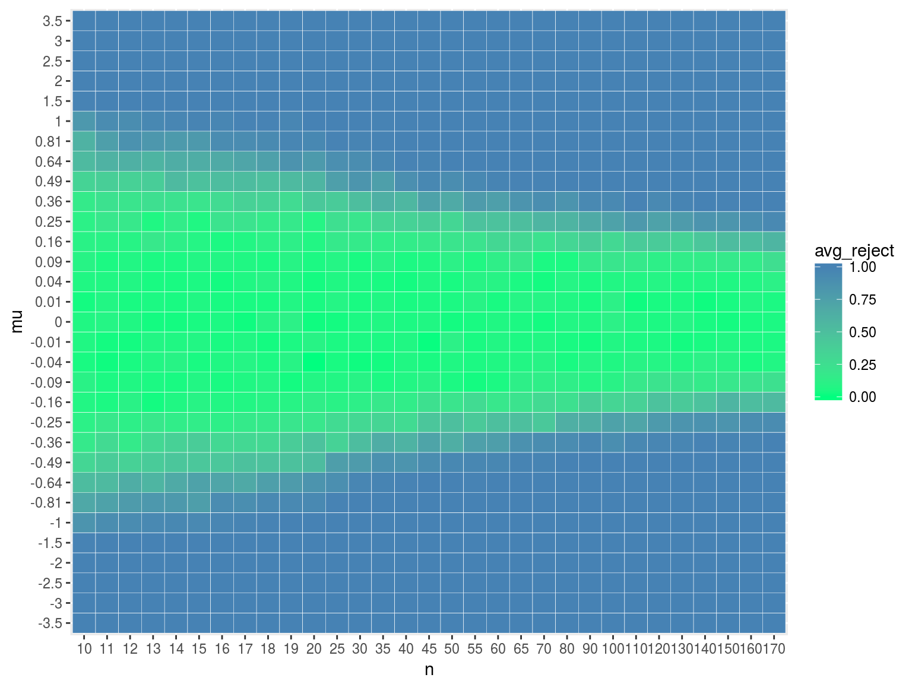
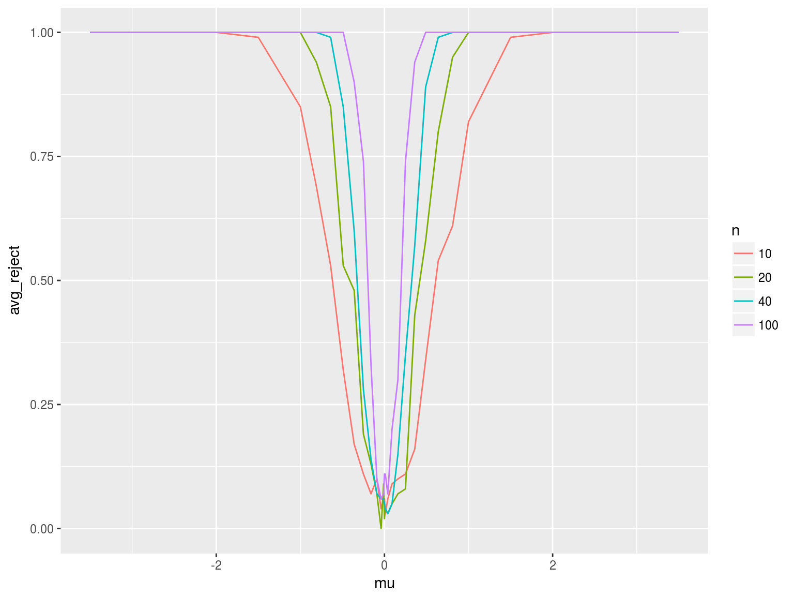
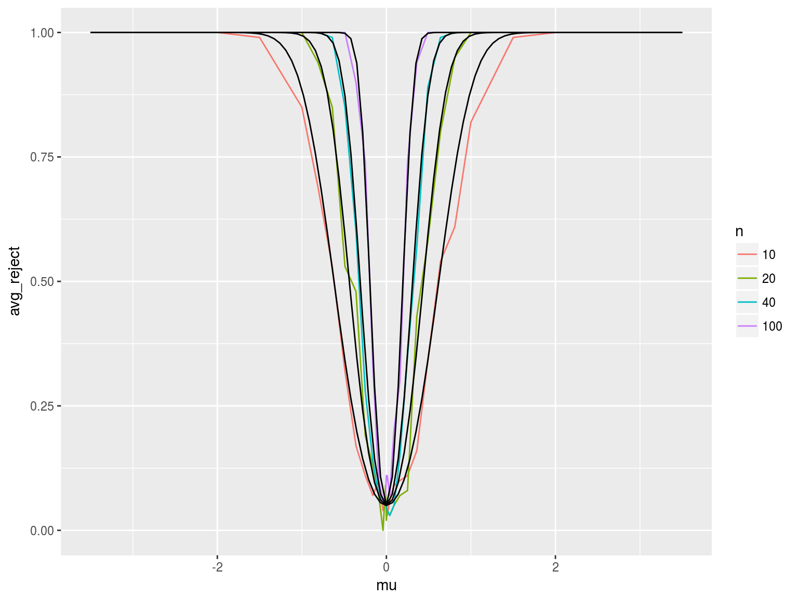
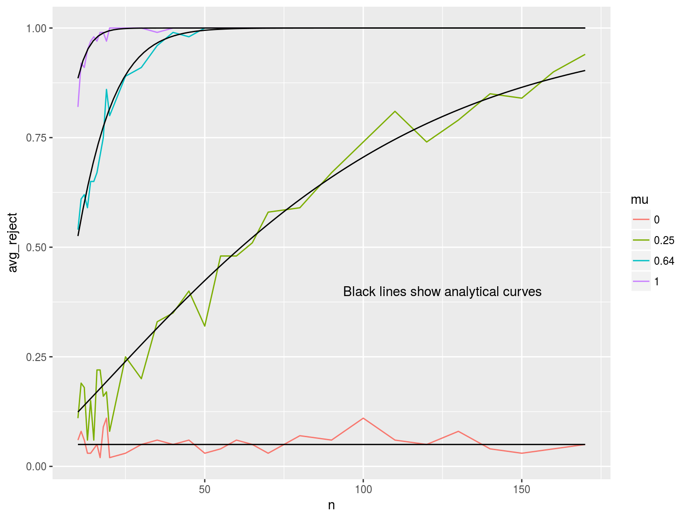

# Power Enveloppe

## Analytical results
-The power curve represents the probability of rejecting the null hypothesis given that the null is false. 

-We derive a power curve for a two sided test with $\frac{\alpha}{2} = 0.025$.

-Notice that since the $x_i$ are drawn i.i.d. from a Normal with known mean and variance, the mean $\bar{x}$ is normally distributed with mean $\mu$ and variance $\frac{\sigma^2}{N} = \frac{1}{N}$ for all $N$.

##
-Then the probability of rejecting $H_0 : \mu =0 \ | \ \mu \neq 0$ is:

$Pr\left[\left|\frac{\bar{x} - 0}{\sqrt{\hat{V_{\bar{x}}}}}\right| > z_{0.025} | \sqrt{N}\left(\bar{x} - \mu\right) \sim  N(0,1)  \right]$

= $Pr\left[\sqrt{N}(\bar{x} - \mu) > (1.96 - \sqrt{N}\mu) | \sqrt{N}\left(\bar{x} - \mu\right) \sim  N(0,1)  \right]$ + $Pr\left[\sqrt{N}(\bar{x} - \mu) < (-1.96 - \sqrt{N}\mu) | \sqrt{N}\left(\bar{x} - \mu\right) \sim  N(0,1)  \right]$

= $1 - \Phi(1.645 - \sqrt{N}\mu) + \Phi(1.645 - \sqrt{N}\mu)$

-For any $N$ and $\mu$, the power of the mean test is $1 - \Phi(1.96 - \sqrt{N}\mu) + \Phi(1.96 - \sqrt{N}\mu)$.

## Heatmap

## Power curve, varying $n$

## Power curve, varying $n$

Analytical curves included

## Power curve, varying $\mu$

## Power calculations

Clearly, when n = 500, the power of the test is essentially 1, far above 0.8. To reach power of 0.9, we require n = 11. 
