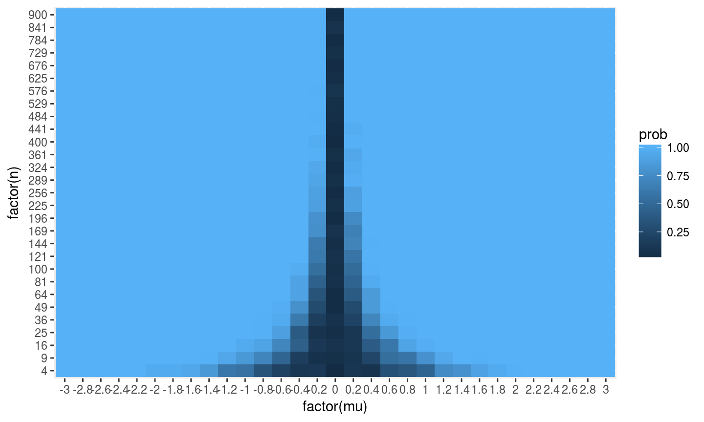
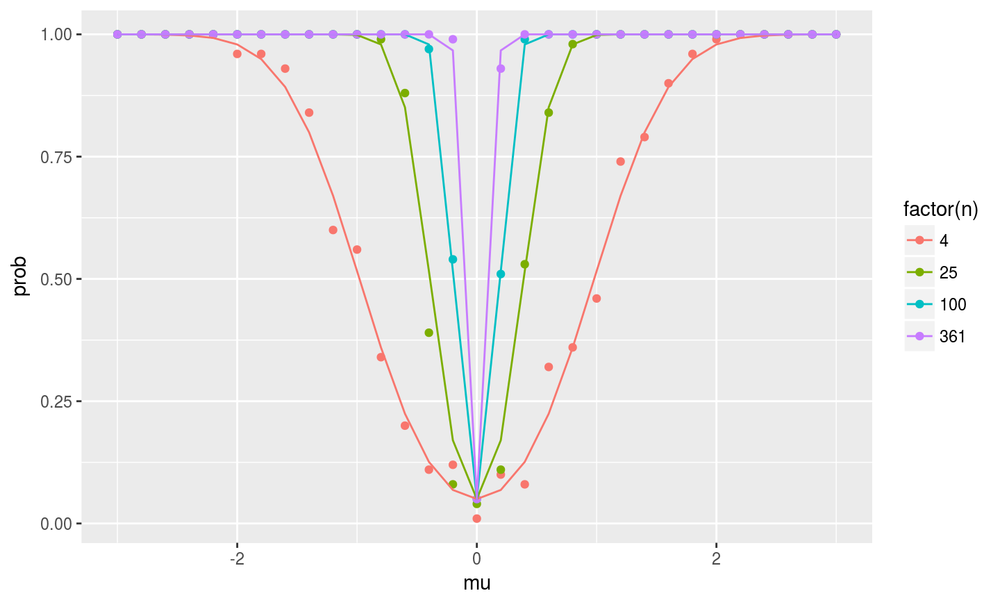
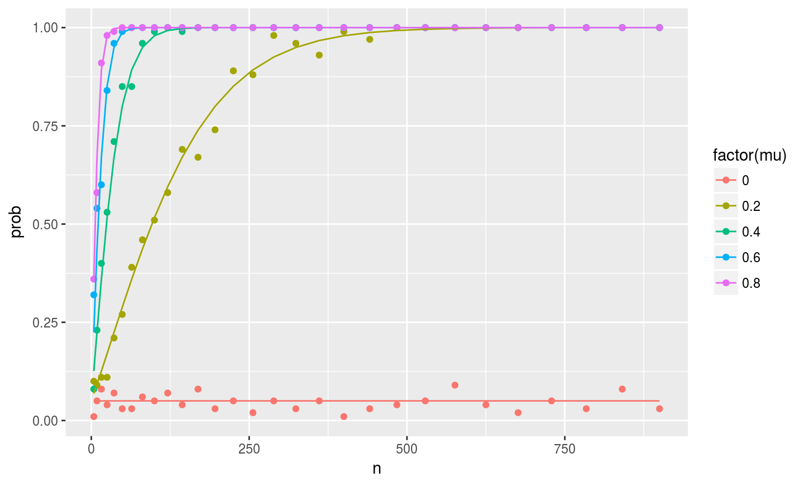

## Analytical Results

\[\begin{aligned}
power&=Pr(Reject H_0|H_1)\\
&=Pr(|t|>c|\mu=\mu_0)\\
&=Pr(\frac{\overline{x}-0}{\sqrt{\frac{1}{n}}}>c|\mu=\mu_0)+Pr(\frac{\overline{x}-0}{\sqrt{\frac{1}{n}}}<-c|\mu=\mu_0)\\
&=Pr(\frac{\overline{x}-\mu_0}{\sqrt{\frac{1}{n}}}>\frac{c\sqrt{\frac{1}{n}}-\mu_0}{\sqrt{\frac{1}{n}}}|\mu=\mu_0)+Pr(\frac{\overline{x}-\mu_0}{\sqrt{\frac{1}{n}}}<\frac{-c\sqrt{\frac{1}{n}}-\mu_0}{\sqrt{\frac{1}{n}}}|\mu=\mu_0)\\
&=1-\Phi(c-\frac{\mu_0}{\sqrt{\frac{1}{n}}})+\Phi(-c-\frac{\mu_0}{\sqrt{\frac{1}{n}}})
\end{aligned}\]


## Question 1



##Question 2



##Question3



##Question5


```
## [1] 1
```

```
## [1] 11
```
