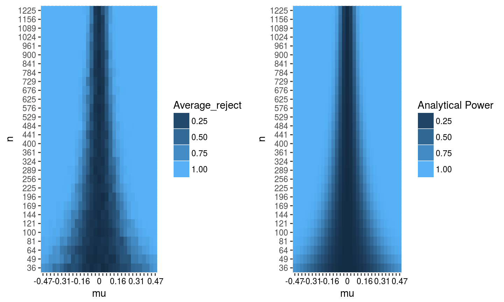
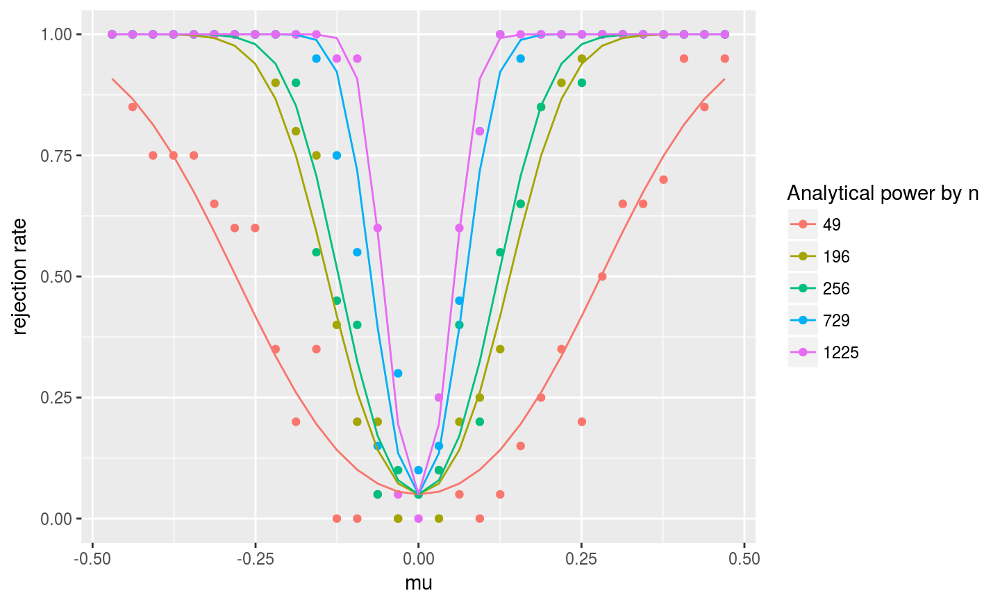
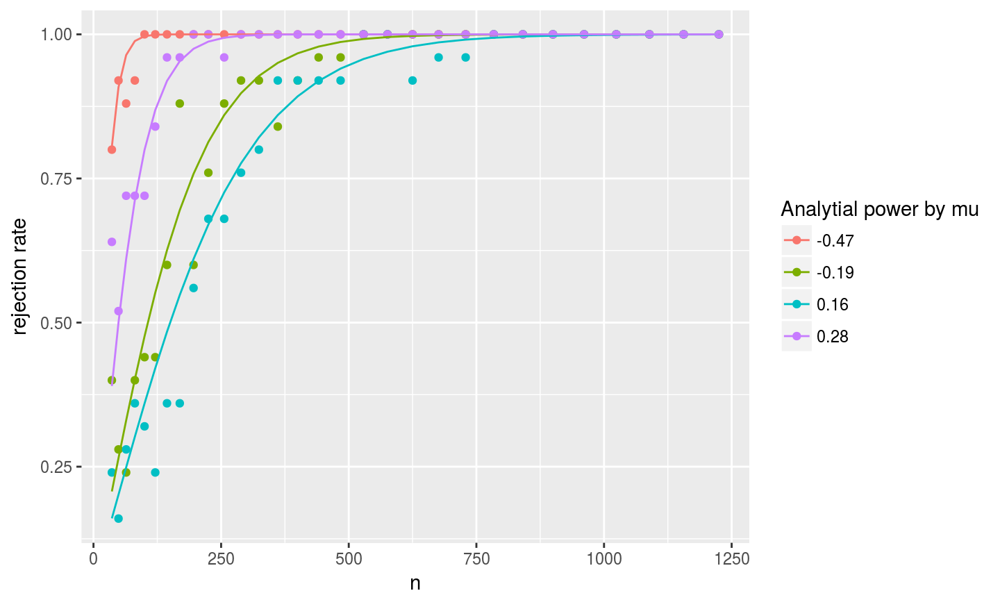
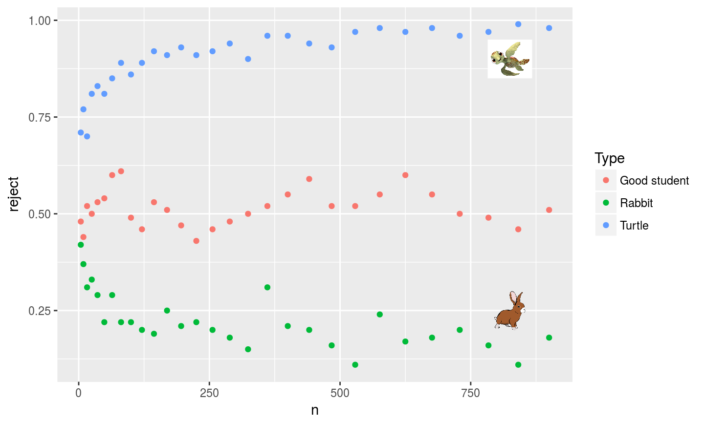

## Analytical results: Power

The power is one minus the probability of a type II error.

$\pi(\beta) = Pr(Reject H_0|H_1 = true) = Pr(|t|>c|\mu)$  

$=Pr(t>c|\mu)+Pr(t<-c|\mu)$

$=1-Pr(\frac{\bar x}{\frac{1}{\sqrt n}}<c|\mu) + Pr(\frac{\bar x}{\frac{1}{\sqrt n}}<-c|\mu)$

$=1-\phi(\frac{c*\frac{1}{\sqrt n}-\mu}{\sqrt\frac{1}{n}}) + \phi(\frac{-c*\frac{1}{\sqrt n}-\mu}{\sqrt\frac{1}{n}})$

$=1-\phi({c-\mu*\sqrt n}) + \phi({-c-\mu*\sqrt n})$

##Heatmap of Rejection Rates

The rejection rates closely mirror the power, as expected.

##Power Curves by n

As n increases, we see the power curve improving so that for the same $\mu$ we now have a higher power.

##Power curves by mu

The rejection rate, and the power, increases as n increases.  This happens faster for $\mu$ further from 0.

## Student questions
When $H_0:\mu=0$, $\mu=1$, and $n=500$, the power is 1.  
For $\mu=1$, we would need $n=11$ for a power of 0.90.  

<table class="table" style="font-size: 22px; margin-left: auto; margin-right: auto;">
<caption style="font-size: initial !important;">Table 1: power table</caption>
 <thead>
  <tr>
   <th style="text-align:right;"> mu </th>
   <th style="text-align:right;"> n </th>
   <th style="text-align:right;"> rrate </th>
   <th style="text-align:right;"> power_theo </th>
  </tr>
 </thead>
<tbody>
  <tr>
   <td style="text-align:right;"> 1 </td>
   <td style="text-align:right;width: 2em; "> 5 </td>
   <td style="text-align:right;width: 4em; "> 0.800 </td>
   <td style="text-align:right;"> 0.609 </td>
  </tr>
  <tr>
   <td style="text-align:right;"> 1 </td>
   <td style="text-align:right;width: 2em; "> 6 </td>
   <td style="text-align:right;width: 4em; "> 0.444 </td>
   <td style="text-align:right;"> 0.688 </td>
  </tr>
  <tr>
   <td style="text-align:right;"> 1 </td>
   <td style="text-align:right;width: 2em; "> 7 </td>
   <td style="text-align:right;width: 4em; "> 0.889 </td>
   <td style="text-align:right;"> 0.754 </td>
  </tr>
  <tr>
   <td style="text-align:right;"> 1 </td>
   <td style="text-align:right;width: 2em; "> 8 </td>
   <td style="text-align:right;width: 4em; "> 0.778 </td>
   <td style="text-align:right;"> 0.807 </td>
  </tr>
  <tr>
   <td style="text-align:right;"> 1 </td>
   <td style="text-align:right;width: 2em; "> 9 </td>
   <td style="text-align:right;width: 4em; "> 1.000 </td>
   <td style="text-align:right;"> 0.851 </td>
  </tr>
  <tr>
   <td style="text-align:right;"> 1 </td>
   <td style="text-align:right;width: 2em; "> 10 </td>
   <td style="text-align:right;width: 4em; "> 0.778 </td>
   <td style="text-align:right;"> 0.885 </td>
  </tr>
  <tr>
   <td style="text-align:right;"> 1 </td>
   <td style="text-align:right;width: 2em; "> 11 </td>
   <td style="text-align:right;width: 4em; "> 1.000 </td>
   <td style="text-align:right;"> 0.913 </td>
  </tr>
  <tr>
   <td style="text-align:right;"> 1 </td>
   <td style="text-align:right;width: 2em; "> 12 </td>
   <td style="text-align:right;width: 4em; "> 1.000 </td>
   <td style="text-align:right;"> 0.934 </td>
  </tr>
  <tr>
   <td style="text-align:right;"> 1 </td>
   <td style="text-align:right;width: 2em; "> 13 </td>
   <td style="text-align:right;width: 4em; "> 1.000 </td>
   <td style="text-align:right;"> 0.950 </td>
  </tr>
  <tr>
   <td style="text-align:right;"> 1 </td>
   <td style="text-align:right;width: 2em; "> 14 </td>
   <td style="text-align:right;width: 4em; "> 1.000 </td>
   <td style="text-align:right;"> 0.963 </td>
  </tr>
  <tr>
   <td style="text-align:right;"> 1 </td>
   <td style="text-align:right;width: 2em; "> 15 </td>
   <td style="text-align:right;width: 4em; "> 1.000 </td>
   <td style="text-align:right;"> 0.972 </td>
  </tr>
</tbody>
</table>

## The Turtle and the Hare: Logic

$$t = \frac{\bar x-\mu_o}{\frac{1}{\sqrt n}} = \frac{\bar x-\mu_a}{\frac{1}{\sqrt n}} + \frac{\mu_a -\mu_o}{\frac{1}{\sqrt n}} \xrightarrow[]{d} ~N(0,1)+\frac{\mu_a}{\frac{1}{\sqrt n}}$$ 

For the good student, $\frac{\mu_a}{\frac{1}{\sqrt n}} = \frac{\frac{2}{\sqrt n}}{\frac{1}{\sqrt n}} = 2$

For the hare, $\frac{\mu_a}{\frac{1}{\sqrt n}} = \frac{\frac{2}{n^{0.6}}}{\frac{1}{\sqrt n}} = \frac{2}{n^{0.1}} \xrightarrow[]{p} 0$

For the turtle, $\frac{\mu_a}{\frac{1}{\sqrt n}} = \frac{\frac{2}{n^{0.4}}}{\frac{1}{\sqrt n}} = 2*n^{0.1} \xrightarrow[]{p} \infty$

## The Turtle and the Hare

