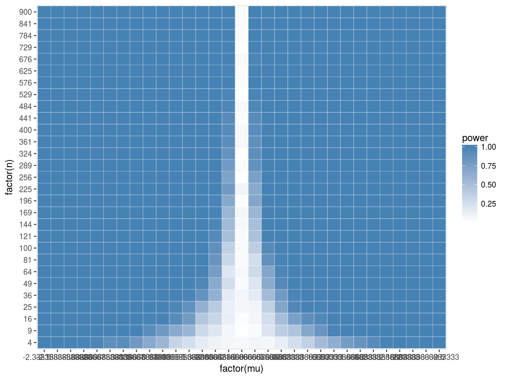
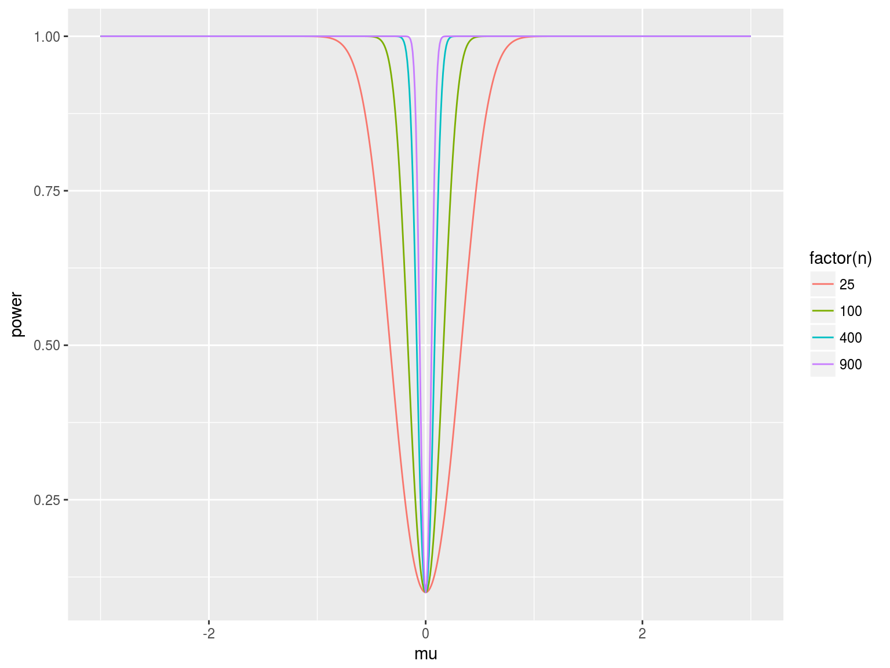
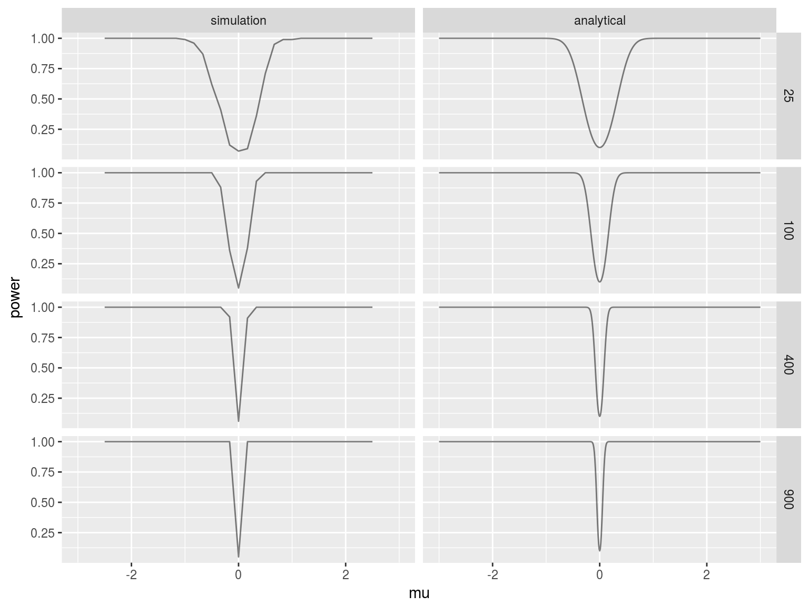
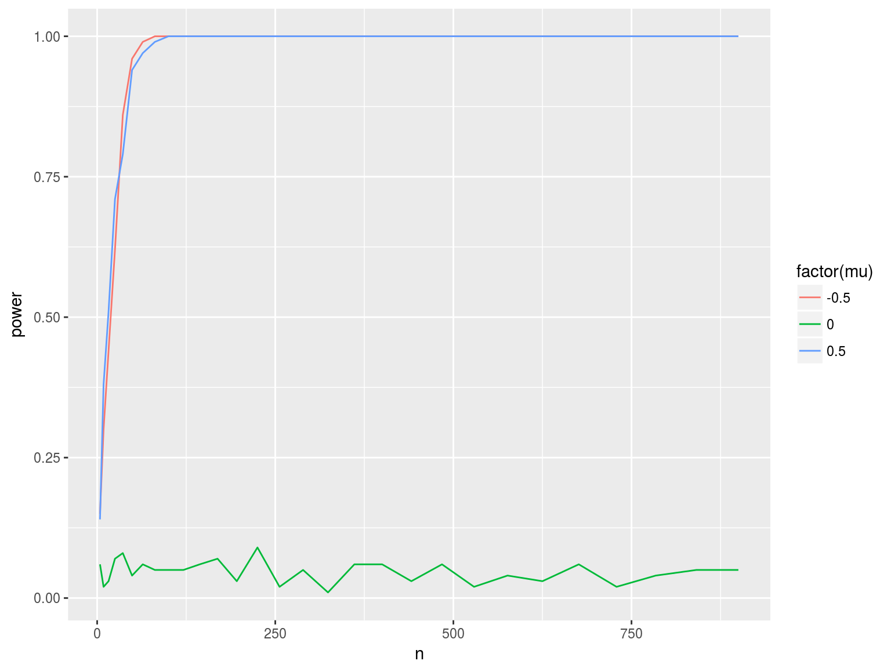

```r
library(magrittr)
library(dplyr)
library(MASS)
```

```
## 
## Attaching package: 'MASS'
```

```
## The following object is masked from 'package:dplyr':
## 
##     select
```

```r
library(purrr)
library(tidyverse)
library(ggplot2)
library(pwr)
library(PASWR)
```

```
## Loading required package: e1071
```

```
## Loading required package: lattice
```


#####HeatMap



#####Simulation Plot


#####Analytical Plot




#####Analytical vs Simulation 1


#####Analytical vs Simulation 2



#####Simulation Graph for different mu




#####Question 5 
######When the sample size is 500 and the difference to be detected is 1; the power is 100%. For 90% power,  a sample size of 21 is sufficient.


