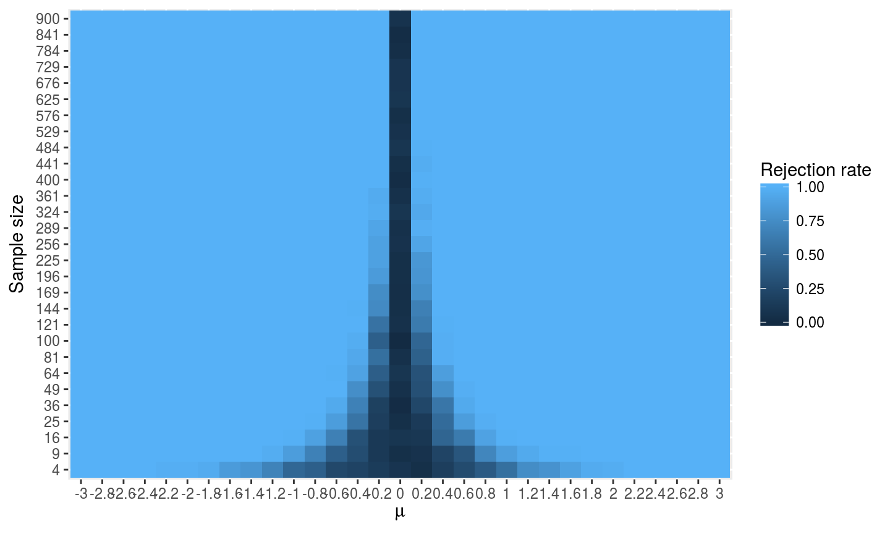
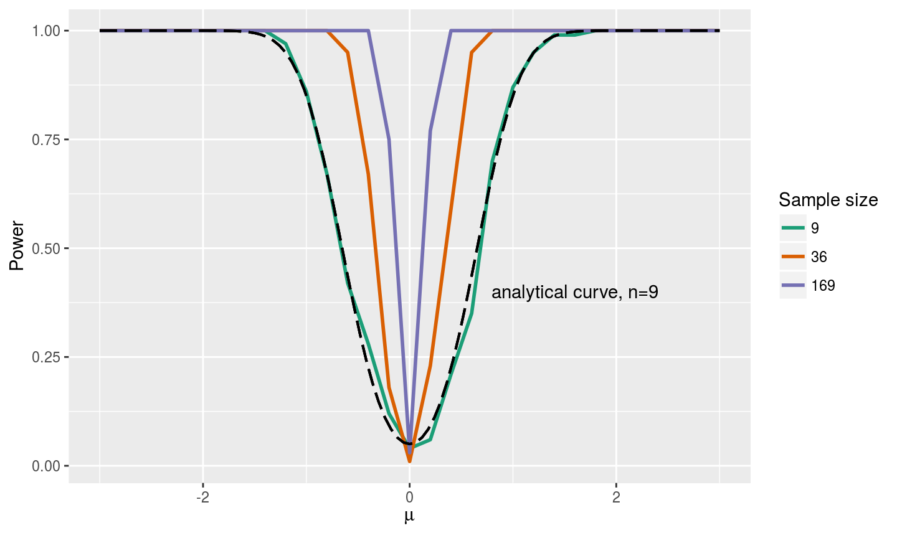
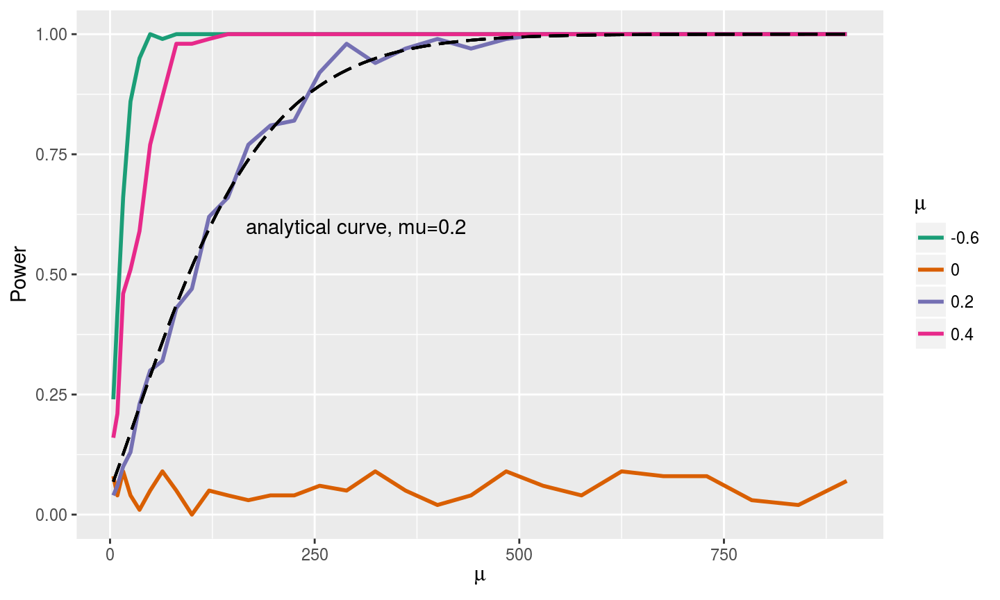
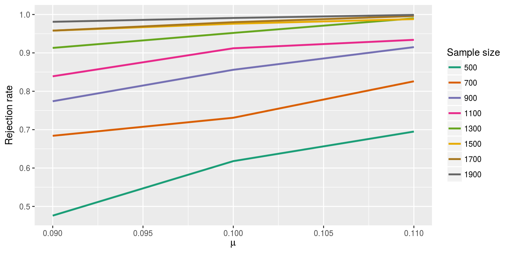

## Analytical solution {.smaller}

Let $X\sim N(\mu,1)$. We want to test $\mathbb{H}_0 : \mu = 0$ versus $\mathbb{H}_1 : \mu \neq 0$. We reject $\mathbb{H}_0$ if $|T|>c$ and note $T = (\bar{X}-\mu_0)/(\sigma\sqrt{n})$. We denote c as $z_{\alpha/2}$, and each null and alternative hypotheses as $\mu_0$ and $\mu_1$, respectively.
We assume that $\sigma = 1$, and, given the alternative hypothesis, know that $\frac{(\bar{X}-\mu_1)}{(\sigma/\sqrt{n})}$ is standard-normally distributed. 

The power function is
$${\begin{align*}
\pi(\mu) & = \text{Pr} \left( 
T < - z_{\alpha/2} 
: \mathbb{H}_1 \right) + 
\text{Pr}\left(
T > z_{\alpha/2}
: \mathbb{H}_1 \right) \\
& = 
\text{Pr} \left( 
(\bar{X}-\mu_0)/(\sigma/\sqrt{n}) < - z_{\alpha/2}
: \mathbb{H}_1 \right) \\
& + \text{Pr}\left(
(\bar{X}-\mu_0)/(\sigma/\sqrt{n}) > z_{\alpha/2}
: \mathbb{H}_1 \right) \\
& = 
\text{Pr} \left( 
(\bar{X}-\mu_0-\mu_1)\sqrt{n} < - z_{\alpha/2} - \mu_1\sqrt{n} 
: \mathbb{H}_1 \right) \\
& + \text{Pr}\left(
(\bar{X}-\mu_0-\mu_1)\sqrt{n} > z_{\alpha/2} - \mu_1\sqrt{n} 
: \mathbb{H}_1 \right) \\
& = 
\text{Pr} \left( 
(\bar{X}-\mu_1)\sqrt{n} < - z_{\alpha/2} + (\mu_0 - \mu_1)\sqrt{n} 
: \mathbb{H}_1 \right) \\
& + \text{Pr}\left(
(\bar{X}-\mu_1)\sqrt{n} > z_{\alpha/2} +(\mu_0 -\mu_1)\sqrt{n} 
: \mathbb{H}_1 \right) \\
& = \Phi\left(- z_{\alpha/2} + \sqrt{n}(\mu_0-\mu_1)   \right) + 1 - \Phi\left(z_{\alpha/2} + \sqrt{n}(\mu_0-\mu_1) \right)
\end{align*}}$$

## 1. Heat Map of Rejection Rates

## 2. Represent Power Curve vs. Mu

## 3. Represent Power Curve vs. Mu

## 5. Numerical Estimate {.smaller}

If $\mu = 1$, then $n=500$ is easily a large enough to achieve 80% power. To achieve 90% power it would require $n \geq 11$ based on our analytical solution. A more interesting question is if $\mu = 0.1$, then $n=500$ would not achieve 80% power. To achieve 90% power with $\mu = 0.1$, it would require $n \geq 1051$.

