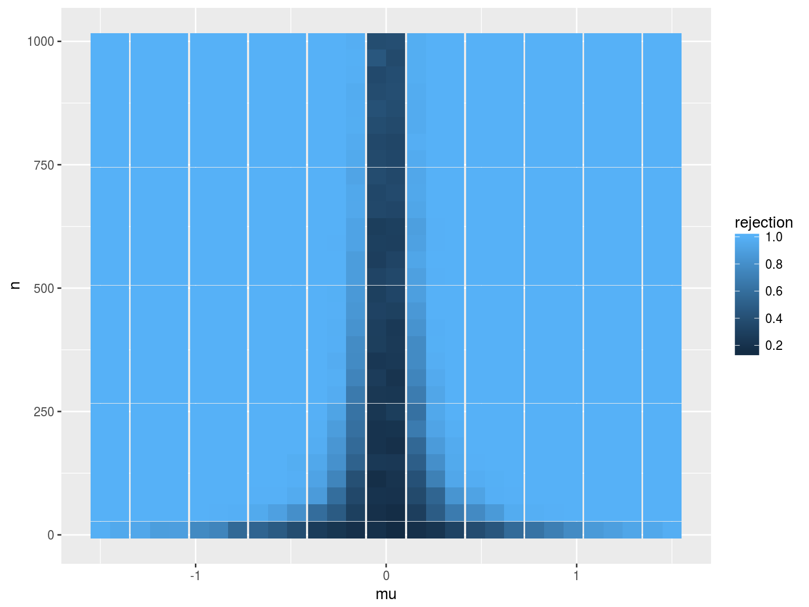
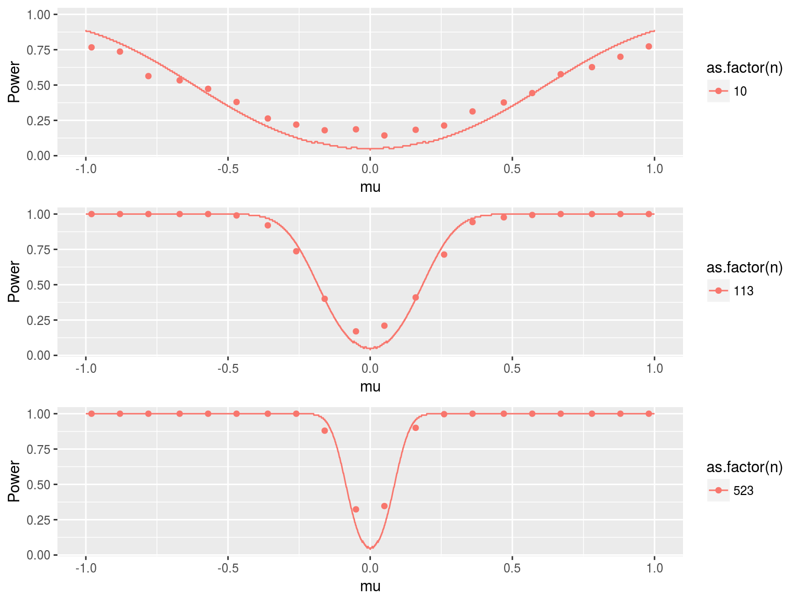
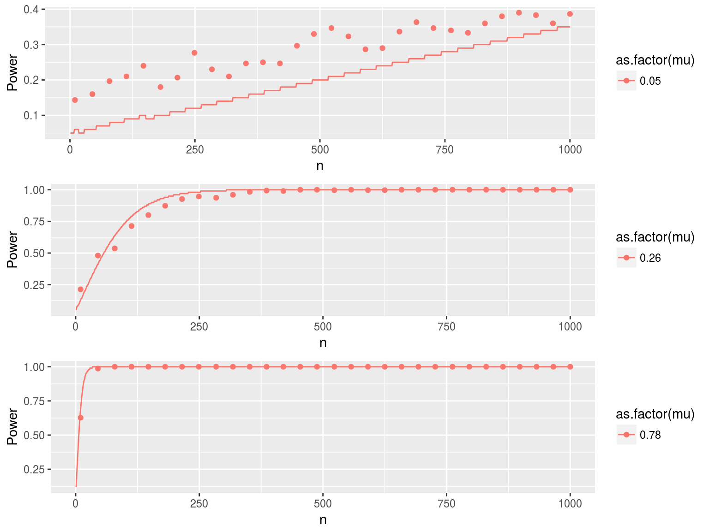

## Analytical results - Power function

- The power function is the probability that $H_o$ is rejected given true $\mu$:
$$ P(\bar{\mu}>c |\mu=\mu_0) + P(\bar{\mu}< -c |\mu=\mu_0) \hspace{1em}\text{where} \hspace{0.5em} c > 0$$  
- We now have a function of two variables, $n$ and $\mu_o$. Our test statistic $T = \frac{\bar{\mu}-\mu_o}{se(\bar{\mu})} = \frac{\bar{\mu}}{\frac{1}{\sqrt{n}}}$  
- Thus the power function, with $\Phi(\cdot)$ as the CDF of the standard normal distribution, is
$$\Phi(\sqrt{n}\bar{\mu}<-1.96|\mu=\mu_0) + 1- \Phi(\sqrt{n}\bar{\mu}<1.96|\mu=\mu_0)$$
- As $\sqrt{n}\bar{\mu}$ increases in absolute value with either $\mu$ or $n$, the probability that $H_o$ is rejected goes to 1.  

## Heatmap of average reject rates 

## Simulation results (1)

(Note: Dots and line represent simulation results and analytical data, respectively.)

## Simulation results (2)

(Note: Dots and line represent simulation results and analytical data, respectively.)

## Test Consistency

For any c and $\mu \neq 0$, the test power converges to 1 as $n \to \infty$. This means, when $\mu \neq 0$, we rejest $H_0$ with probability equals to 1 as  $n \to \infty$, which means the test is consistent. Moreover, when the sample size gets larger, the power converges more quickly to 1. 

## Detecting the difference

- Case 1: When the true $\mu$ is $1$, according to previous simulation reults, the power passes $0.8$ shortly after several sample size increasing. When the sample size is $500$, the power is approximately $1$.

Here is a proof, which is consistent with what we have learned from the plot.

Power = P[Reject $H_0$ $|$ $H_0$ not true]. Given that $X_i \sim N(\mu,1)$, $\alpha=0.05$ and $n=500$, we can calculate the power of the test where $H_0=0$ vs $H_a=1$.
	\begin{align*}
    	Power &= Pr \bigg[\frac{\bar{x}-0}{\sqrt{1/n} } >c | \mu \bigg] + Pr \bigg[\frac{\bar{x}-0}{\sqrt{1/n} } <-c | \mu \bigg]\\
         &= Pr \bigg[\frac{\bar{x}-\mu}{\sqrt{1/n} } > c-\frac{\mu}{\sqrt{1/n}} \bigg] + Pr \bigg[\frac{\bar{x}-\mu}{\sqrt{1/n} } <-c-\frac{\mu}{\sqrt{1/n}} \bigg]\\
        \text{Since} \frac{\bar{x}-\mu}{\sqrt{1/n}} \sim N(0,1). \text{Thus}:\\
       Power &= 1-\Phi \bigg({c-\frac{\mu}{\sqrt{1/n}}} \bigg) + \Phi \bigg({-c-\frac{\mu}{\sqrt{1/n}}} \bigg)
    \end{align*}
If we plugging $\mu=1$, $n=500$, $c=1.96$, we get power is $1$.

- Case 2: By choosing different sample size value iteratively, we found that when $\mu=1$, a sample size of $11$ will result in 90% power. 

## Local power, the turtle and the rabbit

good student: $\mu ^g_n = \mu + \frac{h}{\sqrt{n}} = 0 + \frac{2}{\sqrt{n}}$.

turtle: $\mu ^t_n = \mu + \frac{h}{n^{0.4}} = 0 + \frac{2}{n^{0.4}}$.

rabbit: $\mu ^r_n = \mu + \frac{h}{n^{0.6}} = 0 + \frac{2}{n^{0.6}}$.

Let d $\equiv$ normalized distance between $\mu_0$ and $\mu_n$. 

\[
\begin{eqnarray}
T &=\frac{\hat {\mu}-\mu_n}{s(\hat{\mu})} &+ \frac{\hat {\mu_n}-\mu_0}{s(\hat{\mu})}\\
  &=\frac{\hat {\mu}-(0+d)}{s(\hat{\mu})} &+ \frac{\sqrt{n}\mu_n}{\sqrt{\hat{V_{\mu}}}}\\
\end{eqnarray}
\]

\[
\begin{eqnarray}
T^g&=\frac{\hat {\mu}}{s(\hat{\mu})} &- \frac{d}{s(\hat{\mu})} + \frac{2}{\sqrt{\hat{V_{\mu}}}}\\ 
T^t&=\frac{\hat {\mu}}{s(\hat{\mu})} &- \frac{d}{s(\hat{\mu})} + n^{0.1} \frac{2}{\sqrt{\hat{V_{\mu}}}}\\ 
T^r&=\frac{\hat {\mu}}{s(\hat{\mu})} &- \frac{d}{s(\hat{\mu})} + n^{-0.1} \frac{2}{\sqrt{\hat{V_{\mu}}}}\\
\end{eqnarray}
\]

\[
\begin{eqnarray}
T^g&=Z&-o_p(1)+\frac{2}{\sqrt{V_{\mu}}}\\ 
T^t&=Z&-o_p(1)+n^{0.1}\frac{2}{\sqrt{V_{\mu}}}\\ 
T^r&=Z&-o_p(1)+n^{-0.1}\frac{2}{\sqrt{V_{\mu}}}
\end{eqnarray}
\]

The test statistics of the good student is invariant to n, the test statistics of the turtle increases as n increases, and the test statistics of the rabbit converges to 0 as $n \to \infty$. 

## Local power, the turtle and the rabbit
We thus have, 
\[
\begin{eqnarray}
T^g &= Z&+2-o_p(1)\\
T^t &= Z&+2n^{0.1}-o_p(1)\\
T^r &= Z&+o_p(1)-o_p(1)
\end{eqnarray}
\]
              
Therefore, the power of the three different sequences of alternatives are: 
\[
\begin{eqnarray}
\pi(\mu_n^g) &= Pr(\lvert T^g \rvert > c \lvert \mu^g_n) &= Pr(\lvert Z+2 \rvert > c) = 1-\Phi(c-2)+\Phi(-2-c) \thickapprox 0.5\\
\pi(\mu_n^t) &= Pr(\lvert T^t \rvert > c \lvert \mu^t_n) &= Pr(\lvert Z+2n^{0.1} \rvert > c) \to 1, n\to \infty\\
\pi(\mu_n^r) &= Pr(\lvert T^r \rvert > c \lvert \mu^r_n) &= Pr(\lvert Z \rvert > c) = 1-\Phi(c)+\Phi(-c) =0.05
\end{eqnarray}
\]

We expect to detect the good student with 50% confidence no matter what n is. For the turtle, we will be able to catch it with growing confidence as n gets large. In the case of the rabbit, the probability that we catch it actually decreases as n grows, and this probability eventually converges to 5%. 

